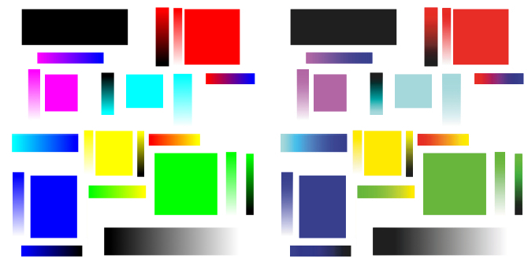
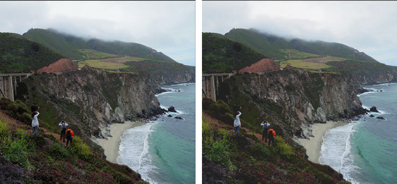

# POD-Softproof
Visualize book cover image in CMYK at 240% ink limit, for print-on-demand.

Print-On-Demand (POD) services often print your book cover using standard
CMYK inks, but with 240% ink limit. This technology has a smaller color space
than the colors available to most modern computer and tablet screens.
So, if you design a beautiful, flashy cover, you may be disappointed by
the printed result.

POD-Softproof allows side-by-side comparison of original image colors versus
the colors that will appear in print. Then you can decide whether to accept
the color changes (if any), or re-design your cover so that the changes are
acceptable. Your original image is not changed.

No compiler is needed. The heavy lifting is done by ImageMagick, a free
program available for most platforms. POD-Softproof contains scripts that
tell ImageMagick what to do. File `softproof.sh` is for Linux, Android
using Termux app, Windows with Linux subsystem, and possibly Mac/BASH.
File `softproof.bat` is for Windows. Whichever you use, the results can
be viewed using `view-softproof.html` in a web browser.

ImageMagick can be installed via Linux package managers, probably named
`imagemagick` or `imagemagick-q16`.

On Windows, you can get an installer directly from the ImageMagick download
page (use Q16). Or, create a folder named `imagemagick` within POD-Softproof,
place the portable ImageMagick zip file there, and unzip it.

For an example: `./softproof.sh example` or `./softproof.bat example`.

For help: `./softproof.sh -h` or `./softproof.bat -h`.

Here is the example, with original image at left, softproof at right.
This image was intentionally created to illustrate large color changes.
In the softproof, notice that deep blues and purples appear grayer.
Greens appear darker. Light greenish-blue appears washed-out. Reds and
yellows are barely shifted (and thus, human skin tones will print well).
It may not be obvious, but the blacks are not as dark in softproof as
they are in the original. This lightening of dark areas is due to the
ink limitations of POD technology.

On the other hand, images with more subtle colors will barely shift.
The next image shows an outdoor scene taken near Bixby Bridge (a famous
place in California's Big Sur region). Original at left, softproof at right.
Notice that the darkest areas are lighter in softproof, and that
the greens are shifted by a very tiny amount:

And here is a photo of a painting by Raffaelino, on exhibit at the Legion of
Honor Museum in San Francisco. Original at left, softproof at right.
Other than a general lightening of the darker colors, there is hardly any
noticeable difference:

IMPORTANT: As of August 20, 2022, the Linux shell script has been tested.
The Windows batch script has not yet been tested; if it fails, that merely
indicates a fixable scripting error, not a fundamental problem.
